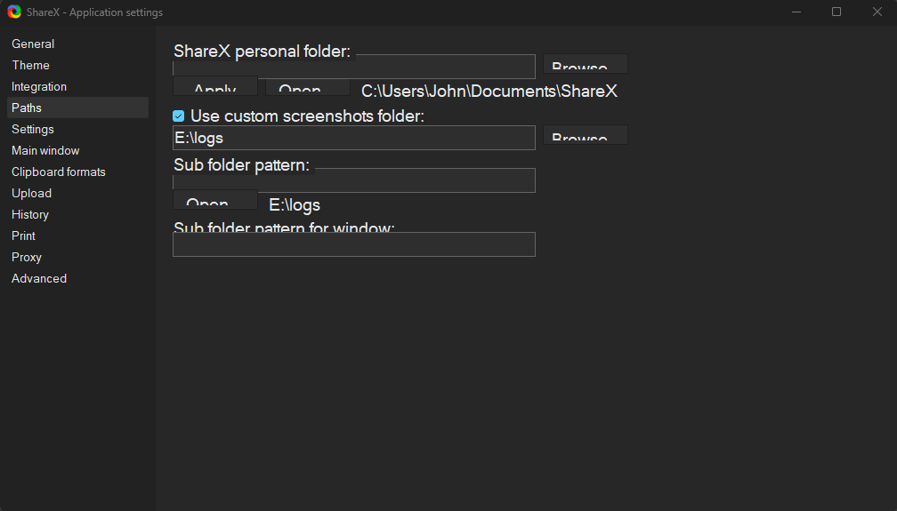
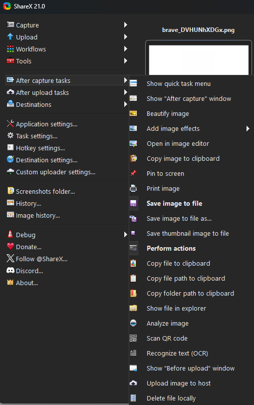
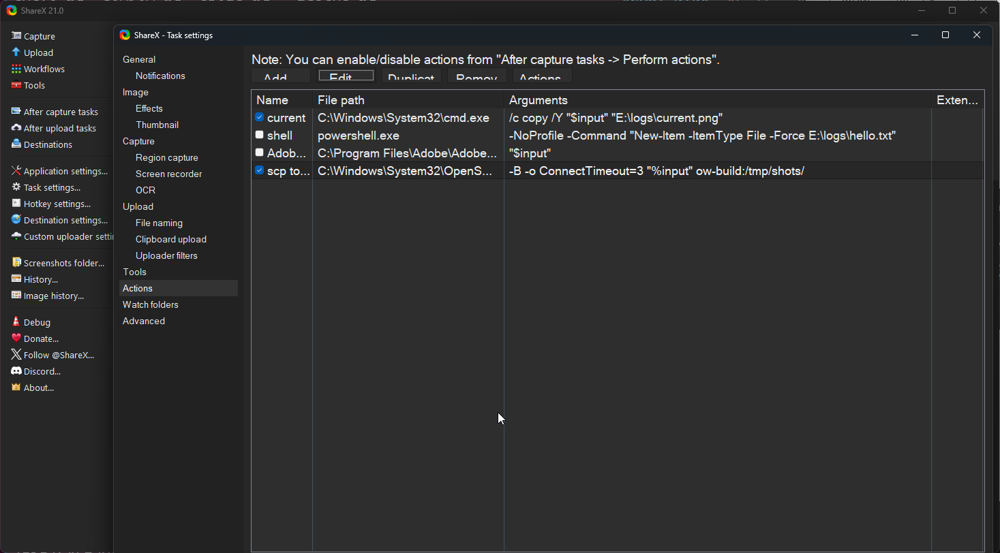
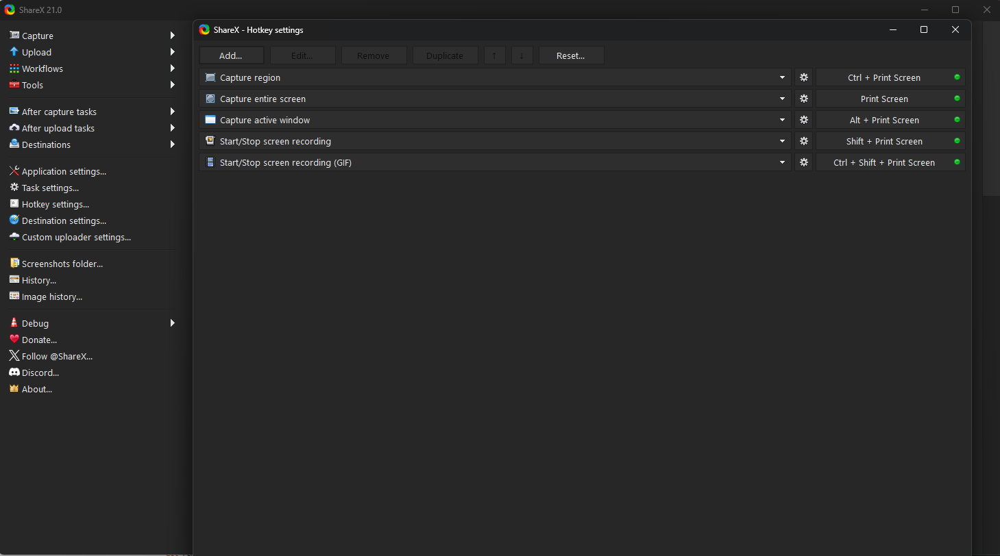

# /shots — screenshots into Claude Code, straight from ShareX

Press a hotkey, type `/shots`, talk about what is on screen. ShareX drops every capture into a
folder; the `/shots` skill lists the newest ones and Claude reads them as images. Nothing is
uploaded and nothing is committed: the folder lives outside every repo, and on a VM it is `/tmp`.
ShareX is Windows-only, but the skill only needs a folder, so any capture tool on any OS works.

## The loop

1. Point at the UI and press **Ctrl+PrintScreen** (region capture), once per thing you want to talk about.
2. In Claude Code: `/shots 2 the dialog in shot 1 is clipped, shot 2 is how it should look`
3. Claude reads both and answers, referring back to the shots by number.

| You type | Claude reads |
|---|---|
| `/shots` | the newest capture |
| `/shots 3 …` | the newest 3 (max 20) |
| `/shots #2 …` | the 2nd newest only |
| `/shots list` | nothing yet; lists the 20 newest so you can pick |

What Claude sees ahead of your request:

```
shots in /mnt/e/logs (newest first):
 1  2026-09-13 12:45   26s    61K  /mnt/e/logs/Screenshot 2026-09-13 124503.png
 2  2026-09-13 12:44    1m    27K  /mnt/e/logs/brave_DVHUNhXDGx.png
READ: all 2 file(s) above, newest first.
```

The age column is how you and Claude notice a capture that never landed. If more captures were
taken within ten minutes of the newest, the listing says how many and which `/shots N` includes them.

## Install

The skill is the `shots/` folder: a `SKILL.md` and one script. Copy it into the personal skills
directory of every machine that runs Claude Code, then point it at the drop folder with `SHOT_DIR`.
Updating is the same copy again; restart Claude Code to pick it up.

```sh
git clone https://github.com/experimenti/skills-shared && cd skills-shared
```

**WSL2, Linux, macOS**

```sh
cp -r shots ~/.claude/skills/
```

**Windows, from PowerShell**

```powershell
Copy-Item -Recurse -Force .\shots "$env:USERPROFILE\.claude\skills\"
```

**A VM you reach over ssh** (the `mkdir` matters: scp into a missing folder copies the contents one level too high)

```sh
ssh ow-build mkdir -p .claude/skills && scp -r shots ow-build:.claude/skills/
```

Then set the drop folder once per machine in that machine's `~/.claude/settings.json`
(`%USERPROFILE%\.claude\settings.json` on Windows), or edit `DEFAULT_DIR` at the top of `shots/scripts/shots.sh`:

```json
{ "env": { "SHOT_DIR": "E:/logs" } }
```

| Claude Code runs on | `SHOT_DIR` | What the script sees |
|---|---|---|
| WSL2 | `E:/logs` | `/mnt/e/logs` |
| Windows, from PowerShell (tool shell is Git Bash) | `E:/logs` | `/e/logs`, printed back as `E:/logs/…` for the Read tool |
| a Linux VM fed by scp | `/tmp/shots` | `/tmp/shots` |
| macOS or a Linux desktop | `~/shots` | `~/shots` |

Optional: `SHOT_PRUNE_DAYS=7` deletes images older than a week from the top level of the drop
folder on each run. Only set it on a folder that holds nothing else.

Notes on the skill itself:

- The listing is a script file rather than inline shell on purpose. Claude Code substitutes `$0`,
  `$1`, … inside inline `` !`…` `` commands with the words you typed, which silently corrupts
  `${1:-10}` or an awk field. The script is bash 3.2 and uses `ls`, `grep` and `stat` only.
- The `allowed-tools: Bash(bash *scripts/shots.sh*)` line is required: without a Bash rule that
  matches the `!` line, the listing is skipped without any error (unless your settings already
  allow Bash globally, which hides the problem).

## ShareX setup

Four screens matter; everything else is default. Screenshots are ShareX 21.

**Application settings → Paths.** A custom screenshots folder on a drive WSL can see, with both
sub-folder patterns empty so files land flat.



**After capture tasks.** Just *Save image to file* and *Perform actions*. Add *Copy image to
clipboard* if you also paste shots elsewhere; leave *Open in image editor* off unless you want to
draw an arrow first.



**Task settings → Actions.** External programs ShareX runs on every capture. The one that
matters when Claude Code lives on a VM the host cannot share a drive with:

| Name | File path | Arguments |
|---|---|---|
| scp to ow-build | `C:\Windows\System32\OpenSSH\scp.exe` | `-B -o ConnectTimeout=3 "%input" ow-build:/tmp/shots/` |



`-B` never prompts (key auth). `-o ConnectTimeout=3` stops a capture from hanging while the VM is
down; it is one argument with the equals sign, and it must sit before `"%input"`, because scp on
Windows stops reading options at the first file name. The `current` row, which copied each capture
to a fixed `current.png`, is no longer needed: the skill finds the newest file itself and ignores
`current.png` if you keep it.

**Hotkey settings.** The defaults. Ctrl+PrintScreen (region) does most of the work: a region is
fewer pixels than a full screen, so Claude sees more detail for the same cost. Images are
downscaled to about 1500 px on the long side and cost roughly 1.5k tokens each.



**File naming** (Task settings → File naming), optional: `%y-%mo-%d_%h-%mi-%s_%pn` gives names
that sort in capture order and say which app they came from, such as `2026-09-13_12-45-03_brave.png`,
with no spaces. Random names work too; the skill sorts by modification time either way.

**Not on Windows?** Point any tool at a folder. macOS: `defaults write com.apple.screencapture location ~/shots`
then ⌘⇧4. Linux: Flameshot or GNOME Screenshot with a fixed save folder.

## Working across a VM

The Windows host runs ShareX, the browser and the app under review. Claude Code runs in one of
three places, and the same skill serves all of them.

```
Windows host: ShareX ──save──▶ E:\logs ──▶ /mnt/e/logs        WSL2 Claude Code
                     │                 └─▶ /e/logs            Windows Claude Code (Git Bash)
                     └───scp──▶ ow-build:/tmp/shots           VM Claude Code, over ssh
```

- **WSL2** sees the Windows drive directly. Nothing to copy.
- **Windows-native** Claude Code, launched from a PowerShell tab in Windows Terminal, still runs
  the skill's shell line in Git Bash, so `E:\logs` is `/e/logs` there and comes back as `E:/logs/…`.
- **The VM** (`ow-build`) is a full Linux VM on the same machine, not WSL, used over ssh. It cannot
  see the host's drive, so ShareX pushes every capture to it as it is taken. `ow-build` is an ssh
  alias with key auth on both the host and WSL. `/tmp/shots` empties on reboot, which is the point.
